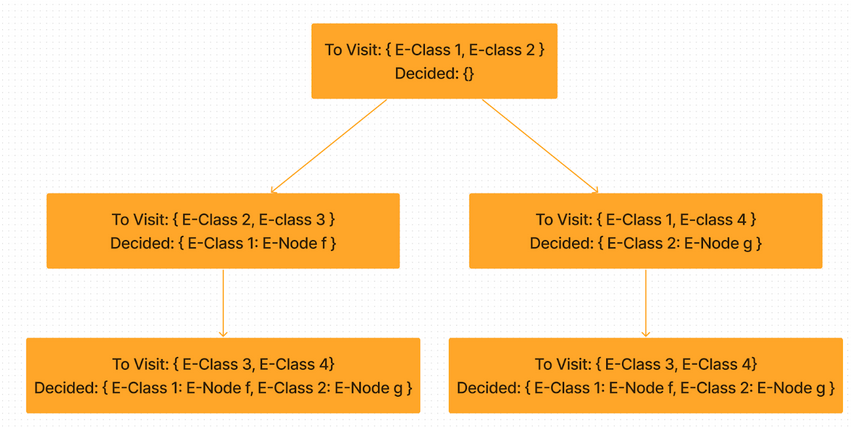
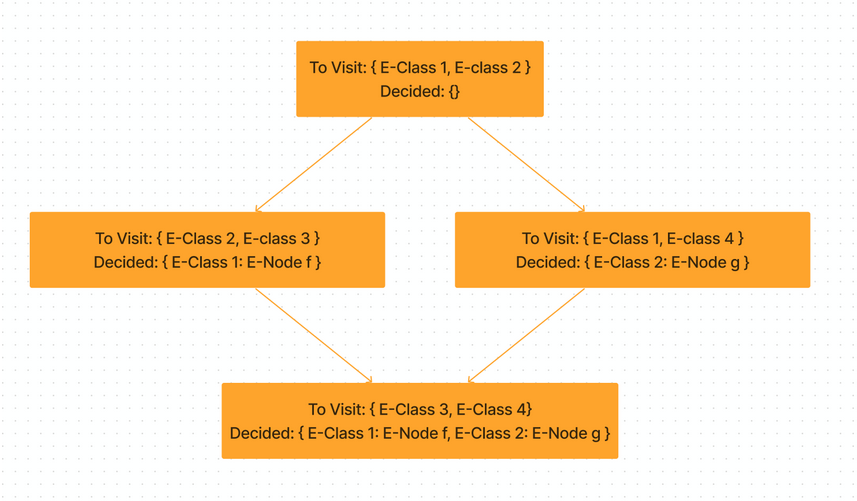
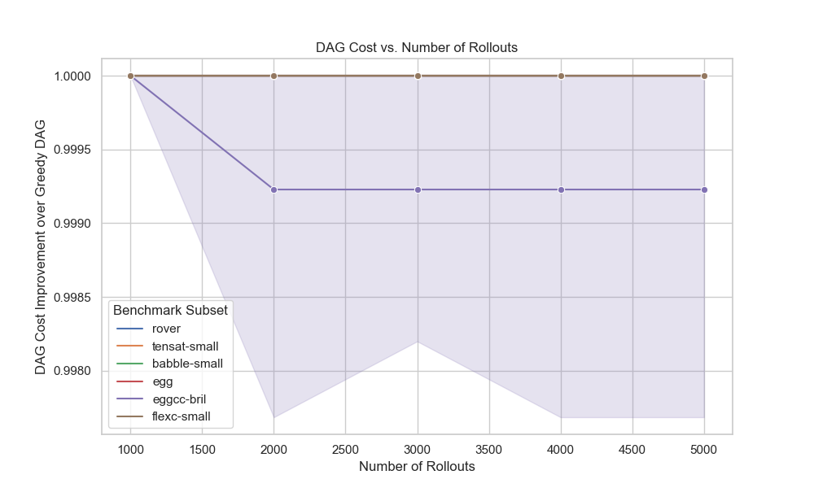
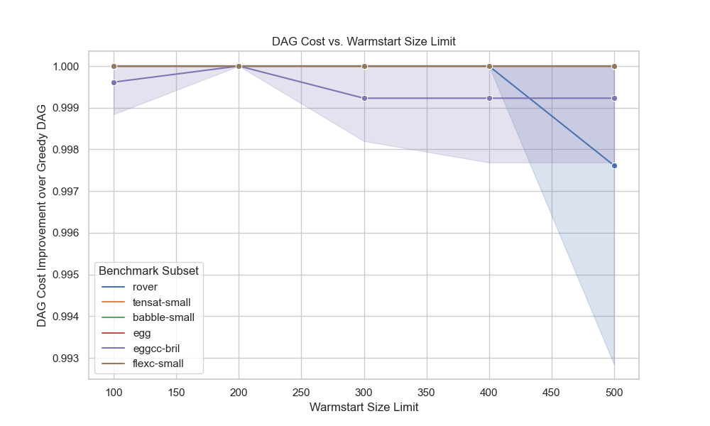
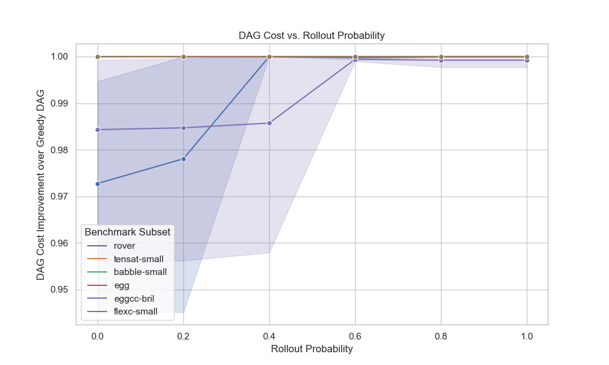
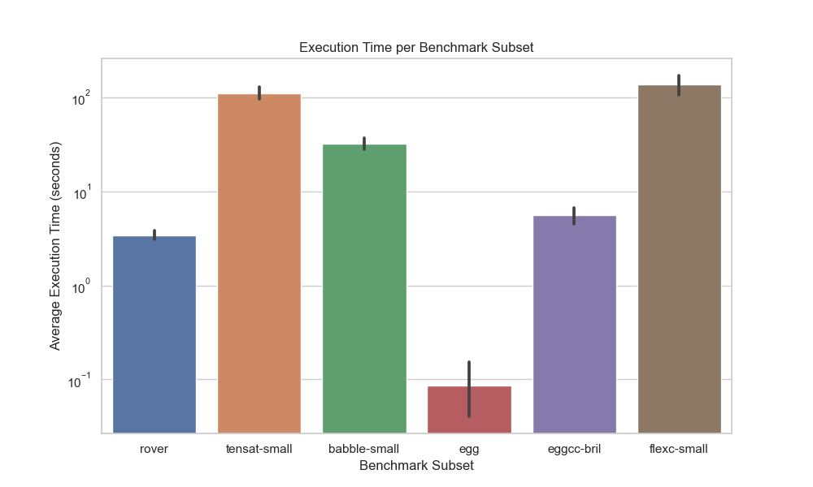

# Monte Carlo Tree Search for E-graph Extraction

### Authors: Jeremy Ferguson (jmfergie@berkeley.edu), Sora Kanosue (sorakanosue@berkeley.edu), Jacob Yim (jacobyim@berkeley.edu)
## Introduction
Extracting the minimum-cost expression from an e-graph is a difficult task, and doing so efficiently is an open area of research. The goal of this project is to improve on existing extraction methods by applying stochastic techniques, namely Monte Carlo tree search.
## Background
### E-graph extraction
E-graph extraction is the task of selecting a DAG forming a complete expression (that is, an assignment of e-classes to e-nodes) from an e-graph such that the total cost of the selected nodes (determined by some cost function mapping nodes to numerical costs) is minimized. Accounting for nodes shared between multiple paths from the root, [the e-graph extraction problem is NP-complete](https://effect.systems/blog/egraph-extraction.html). Existing extraction techniques either a) sacrifice the optimality of the extracted expression, or b) are not guaranteed to terminate:

1. **Bottom-up** extraction is fast, but uses tree cost instead of DAG cost. This means that the minimum-cost expression may not be extracted in e-graphs with “shared” nodes, and can result in dramatically higher costs in some cases.
2. **Greedy DAG** extraction is fast and uses DAG cost to exploit shared structure, but is not guaranteed to find the minimum-cost expression.
3. Extraction using **integer linear programming (ILP)** also uses DAG cost and is guaranteed to find the minimum-cost expression, but may not terminate.

We aim to “strike a balance” between greedy DAG and ILP by searching for solutions more optimal than greedy DAG extractions, but with guarantees about the termination of the algorithm.
### Monte Carlo tree search
To search for a minimum-cost extraction, we adapted the Monte Carlo tree search (MCTS) algorithm. At a high level, MCTS searches for an optimal path through a decision tree, guided by random simulations of future choices. The algorithm operates in four phases:
1. **Selection.** Starting from the root of the decision tree, select child nodes until a leaf is reached. The probability of selecting a given child node is often computed using a formula known as UCT (Upper Confidence Bound 1 applied to trees), our adaptation of which is discussed in the next section.
2. **Expansion.** From the selected leaf, create a new child node and add it to the decision tree.
3. **Simulation.** From the new child node, randomly choose a sequence of decisions from some probability distribution, until the “game” is decided (that is, no more decisions can be made).
4. **Backpropagation.** Depending on the result of the simulation, adjust the probabilities of selecting each node on the path from the root to the new child node.

These four steps are repeated until a maximum number of iterations is reached, after which the most “successful” explored path through the decision tree is returned.

In our case, the decisions in this tree are choices of e-nodes to assign to a given e-class. The next section discusses in detail our implementation of this algorithm.
## Core algorithm
Since the Monte Carlo tree search algorithm operates on a decision tree, we framed e-graph extraction as a task of successively choosing an e-class to canonicalize and then canonicalizing it by choosing an e-node from within that e-graph. As a result, our algorithm explores a decision tree in which each node maintains as its state:
A to-visit set representing the minimal set of e-classes which must be canonicalized in order to yield a well-defined program. Canonicalizing an e-class could result in an expansion of this set due to a chosen e-node having un-canonicalized children.
A decided map of e-classes to e-nodes representing the canonicalization decisions made on the path from the root to this node.

An example decision tree is shown below. 

Another key aspect of the traditional MCTS algorithm lies in encoding the success of each node, influencing the selection phase of the algorithm. To translate this to the domain of e-graphs, we additionally maintained a cost value at each node of our tree, representing at a high level the minimum cost seen to be achievable from that node. More specifically, the minimum cost of a node $N$ was defined to be the minimum DAG cost a well-defined program was seen to have achieved during a random rollout from a child node of $N$. Taking the limit as the number of rollouts approaches infinity, this becomes the minimum DAG cost a program can achieve holding fixed the canonicalization decisions taken on the path from the root to $N$.

The leaf selection portion of MCTS entails selecting child nodes successively until a leaf is found. Early versions of MCTS utilize the UCT formula,  which considers the win-loss ratio of each node, due to the algorithm’s origins in solving in board games. We adapted it to the following formula, which is computed for each child node of a given parent node. In the formula below, $c_i$ represents the minimum cost (discussed above) of a particular child node, $C$ is the set of minimum costs of each child node, $n_i$ the number of rollouts taken so far from a particular child node, $N$ the number of rollouts taken so far from the parent node, and $p$ is the exploration parameter which we fixed to be $\sqrt{2}$, but could be varied for performance empirically. 

UCT formula:
$1 - \frac{c - \texttt{min}(C)}{\texttt{max}(C) - \texttt{min}(C)} + p \sqrt{\frac{\ln{N}}{n_i}}$
## Improvements
Over the course of the project, we made a number of improvements to our algorithm to improve both space and time efficiency. We present the major ones here.
### Monte Carlo DAG Search
Our original, tree-based search algorithm wastes both space and rollouts due to the fact that some nodes of the decision tree are equal modulo the e-classes to be canonicalized and the e-classes canonicalized so far. The figure below demonstrates the simplest case in which duplicate nodes can appear in the decision tree. 

To counteract the duplicated effort which results from these cases, we modified our algorithm to explore a decision DAG, rather than a decision tree by merging nodes with equal to visit sets and decided maps. The figure below shows the DAG-ified version of the tree above.

### Warmstarts
Another issue with our initial algorithm was that the search space of extractable programs for a given e-graph can potentially be very large, and a purely random approach to generating candidate programs is unlikely to outperform the fast, pre-existing greedy extractors. To counteract this, we incorporated these existing extractors into our approach, by running a greedy extractor, and using the result to warmstart our decision DAG. This combined with our UCT strategy allows the random search to be directed towards areas of the search space which could potentially outperform the existing solution. It also has the added benefit that our search will never return a candidate program that costs more than the one returned by a greedy extractor.
### Solution-Guided Rollouts
As mentioned above, a purely random rollout strategy is unlikely to outperform the greedy extractors due to the size of the search space. Another way in which we mitigated this was by having our rollouts also be guided by the solution returned by a random rollout. However, if rollouts were deterministically replicating a fixed solution at every step, it was highly likely that the overall search would remain in the neighborhood of the greedy extractor’s solution. To counteract this, we introduced a parameter which, at every step of the rollout, would randomize whether to choose from the greedy solution for a given e-graph or to randomly choose the next e-class and e-node.
### Evaluation
For our evaluation, we evaluated the DAG costs of our MCTS solution compared to the greedy DAG solution, to see if we could find performance improvements. We used a subset of the existing benchmarks found in the extraction-gym repository, and ablated three different parameters: the number of rollouts, the initial size of the warmstarted graph, and the probability of using the solution-guided rollout or a randomly chosen e-class and e-node at each step of a rollout. We found small improvements over the greedy DAG solution in two of the benchmark subsets, rover and eggcc-bril. While varying the number of rollouts and the warmstart limit, we found that increasing both of these parameters did not significantly improve the DAG cost, with costs on average only 0.1% lower than greedy DAG. We varied the rollout probability, and found that the best improvements came with a low probability of selecting the nodes randomly, around 0.0 and 0.2. This suggests that solution-guided rollouts are a very useful improvement, and points to a direction of future work in further investigation of this algorithm. On average, the rover and eggcc-bril benchmarks had DAG costs 2-3% lower than the greedy DAG solution when the probability of choosing the nodes uniformly randomly was 0.0, compared to 0.1% when the probability is 0.6 or greater. We also report the average execution time over the benchmark subsets, which is on the order of 1,000 times slower than the greedy DAG extractor.

*MCTS performance compared to Greedy DAG extraction, while varying the number of rollouts. The x-axis shows the number of rollouts performed before returning the best DAG found so far. The y-axis shows the ratio of the DAG cost found by our MCTS implementation to the DAG cost found by the greedy DAG extractor. MCTS finds small improvements over the greedy DAG solution on one benchmark subset, eggcc-bril, but no significant effect from increasing the number of rollouts beyond 2,000.*

*MCTS performance compared to Greedy DAG extraction, while varying the size of the warm-started solution. The x-axis shows the number of nodes visited during the warm-starting phase. The y-axis shows the ratio of the DAG cost found by our MCTS implementation to the DAG cost found by the greedy DAG extractor.MCTS finds small improvements over the greedy DAG solution on two benchmark subsets, rover and eggcc-bril, around 0.1-0.3%.*

*MCTS performance compared to Greedy DAG extraction, while varying the random rollout probability. The x-axis shows the probability of selecting an e-node completely randomly during a rollout, as opposed to choosing from the greedy DAG solution. The y-axis shows the ratio of the DAG cost found by our MCTS implementation to the DAG cost found by the greedy DAG extractor. MCTS finds larger improvements compared to the variation on warmstart size and the number of rollout iterations, around 2-3%.*

*Average MCTS execution time. The x-axis shows each subset of the benchmark suite that MCTS was run on. The y-axis shows the average execution time in seconds, on a log scale.The most difficult e-graphs took around 100 seconds on average, which is approximately 100-1,000 times slower than the greedy DAG extractor.*
### Conclusion 
This project shows the results of implementing Monte Carlo Tree Search for e-graph extraction. Our algorithm can improve upon the results of the greedy DAG algorithm. We implemented several improvements upon the naive implementation of the MCTS algorithm, which ensure that it will perform at worst the same as the greedy DAG algorithm. Improvement upon this algorithm is a promising direction for future work, as there are likely more intelligent ways of searching this space to improve the probability of finding more optimal solutions.
